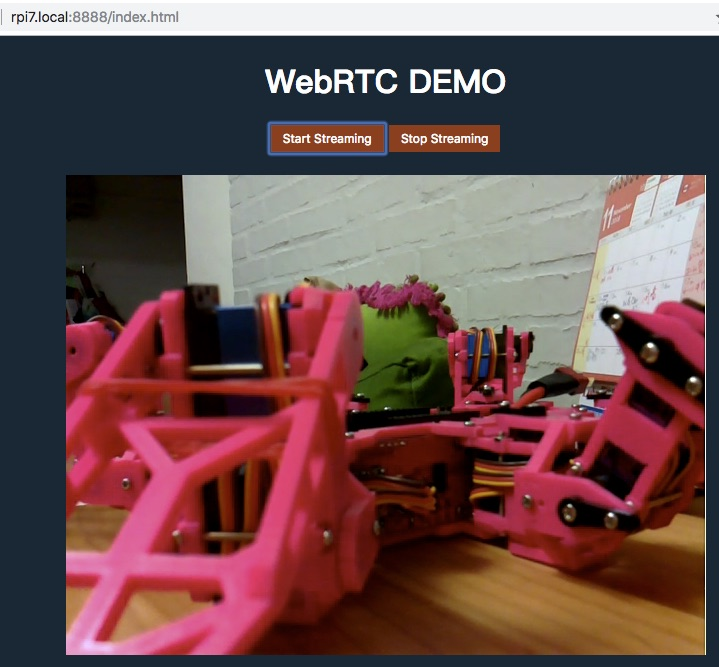

# rpi-webrtc-streaming-to-ios
從樹莓派 RPi 攝影機, 串流 h264 影像到 iOS 裝置 (經 WebRTC)

## RPi 端

以下的步驟在 'RPi Camera module v1.3' 和 'RPi 3 model B+' 和 'RPi Zero W', OS 使用 *Raspbian Stretch*

### 接上攝影機

把攝影機模組接上後開機

### uv4l 安裝

uv4l 的安裝細節可以參考官方說明 https://www.linux-projects.org/uv4l/installation/

以下簡介重要的指令：

1. `curl http://www.linux-projects.org/listing/uv4l_repo/lpkey.asc | sudo apt-key add -`
2. `sudo nano /etc/apt/sources.list`
    * 在最後加上 `deb http://www.linux-projects.org/listing/uv4l_repo/raspbian/stretch stretch main`
3. arm7 系列 (ex. RPi3) 請下 `sudo apt-get install uv4l uv4l-raspicam uv4l-raspicam-extras uv4l-webrtc`
    * arm6 (ex. RPi Zero W) 請下 `sudo apt-get install uv4l uv4l-raspicam uv4l-raspicam-extras uv4l-webrtc-armv6`

### 複製 HTML 網頁

把 `public` 目錄複製到 RPi 上

Ex. `scp -r public pi@yourrpi.local:~/`

### uv4l-server 設定

1. `sudo nano /etc/uv4l/uv4l-raspicam.conf` 並作以下改動

```shell
### These options are specific to the HTTP/HTTPS Server
### serving custom Web pages only:
server-option = --enable-www-server=yes
server-option = --www-root-path=/home/pi/public
server-option = --www-index-file=index.html
server-option = --www-port=8888
...
server-option = --www-webrtc-signaling-path=/webrtc
```

> www-root-path=[public 目錄的位置]

2. `sudo service uv4l_raspicam restart` 重新啟動服務

### 驗證

找一台和 RPi 在同一個網路的裝置 (電腦, iOS 或 Android 裝置), 打開瀏覽器 (建議用 Chrome) 並輸入連結`http://yourrpi.local:8888/index.html` 

應該會看到標題 'WebRTC DEMO' 和二個按鈕 ('Start Streaming' 和 'Stop Streaming')

按下 'Start Streaming', 這時攝影機模組上的紅燈會亮起, 同時在瀏覽器上會看到從攝影機來的影像 !!



> 預設解析度為 640x480 30fps.
> 在 RPI Zero W 上大約會用掉 50% CPU 和 5~60% RAM
> 而在 RPI 3 B+ 上大約只會用掉 20% CPU 和 25% RAM

> 在 `public/signalling.js` 裡可以調整解析度. 可試著搜尋 `vformat: 30` 並把它改到 60 或更大數字

```JavaScript
            var request = {
                what: "call",
                options: {
                    // check https://www.linux-projects.org/documentation/uv4l-server/ for more setting
                    // 10 for 320×240-30fps, 
                    // 20 for 352×288-30fps, 
                    // 30 for 640×480-30fps, 
                    // 40 for 960×720-30fps, 
                    // 50 for 1024×768-30fps, 
                    // 60 for 1280×720-30fps, 
                    // 63 for 1280×720-60fps, 
                    // 65 for 1280×768-15fps, 
                    // 70 for 1280×768-30fps, 
                    // 80 for 1280×960-30fps, 
                    // 90 for 1600×768-30fps, 
                    // 95 for 1640×1232-15fps, 
                    // 97 for 1640×1232-30fps, 
                    // 100 for 1920×1080-15fps, 
                    // 105 for 1920×1080-30fps

                    // If forced, the hardware codec depends on the arch.
                    // (e.g. it's H264 on the Raspberry Pi)
                    // Make sure the browser supports the codec too.
                    force_hw_vcodec: true,
                    vformat: 30, /* 30=640x480, 30 fps */
                    trickle_ice: true
                }
            };
```


## iOS 端

WebRTC 是瀏覽器標準所以多數瀏覽器都支援. 在 iOS 上也可以利用 `WKWebView` 輕易的使用它

只有一些要注意的點:

#### SSL

由於剛才設定的 RPI Web server 並沒有打開 SSL 功能，所以會被 iOS 拒絕使用, 二個選項:

1. 打開 SSL 
2. 允許 WebView 連接不安全的網站

這裡使用選項 2

在 `info.plist` (Open as Source code) 裡加入以下 XML 內容

```XML
    <key>NSAppTransportSecurity</key>
    <dict>
        <key>NSAllowsArbitraryLoadsInWebContent</key>
        <true/>
        <key>NSAllowsArbitraryLoadsForMedia</key>
        <true/>
    </dict>
```

> ps. 順便加了 `NSAllowsArbitraryLoadsForMedia` 讓 WebView 能播放影像

#### 進到背景前停止串流

由於跑在瀏覽器裡的網頁無法得知手機的狀態變化 (例如進到背景), 只有 App 本身才能知道

所以讓網頁提供 `viewPause` 和 `viewResume` 這二個 Javascript API (定義 `public/main.js` 裡)

```JavaScript
    window.addEventListener('DOMContentLoaded', function () {

        ...

        // App will call viewPause/viewResume for view status change
        window.viewPause = stopPlay;
        window.viewResume = startPlay;
    });
```

再讓 App 在狀態變化發生時透過 `webView.evaluateJavaScript` 主動通知呼叫網頁的二個 API

```swift
    override func viewWillDisappear(_ animated: Bool) {
        super.viewWillDisappear(animated)
        
        handleWebView(turn: false)
    }
    
    func willResignActive(notification: Notification) {
        print("willResignActive")
        handleWebView(turn: false)
    }
    
    func didBecomeActive(notification: Notification) {
        print("didBecomeActive")
        handleWebView(turn: true)
    }
    
    func handleWebView(turn on: Bool) {
        var script: String;
        if (on) {
            script = "viewResume()"
        }
        else {
            script = "viewPause()"
        }
        webView.evaluateJavaScript(script) { (result, error) in
            if let e = error {
                print(e)
            }
        }
    }
```


## Reference

* uv4l installation - https://www.linux-projects.org/uv4l/installation/
* uv4l demo - https://www.linux-projects.org/uv4l/tutorials/custom-webapp-with-face-detection/
* webetc adapter - https://github.com/webrtc/adapter
