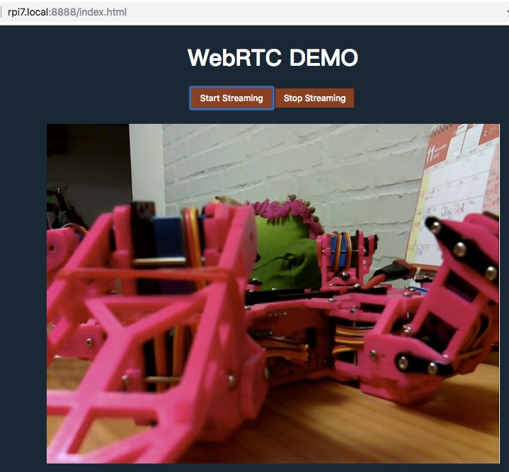

# rpi-webrtc-streaming-to-ios
Streaming h264 from Camera of RPI to iOS devices via WebRTC

[中文版README連結](README-tw.md)

## RPi side

Below steps verified on 'RPi Camera module v1.3' with 'RPi 3 model B+' and 'RPi Zero W', running *Raspbian Stretch*

### Attach Camera

Have your camera module attached to RPi and boot up.

### uv4l installation

Refer to https://www.linux-projects.org/uv4l/installation/ for more detail

A summary of command history:

1. `curl http://www.linux-projects.org/listing/uv4l_repo/lpkey.asc | sudo apt-key add -`
2. `sudo nano /etc/apt/sources.list`
    * add `deb http://www.linux-projects.org/listing/uv4l_repo/raspbian/stretch stretch main` to the end.
3. for ARM7 (RPi3): `sudo apt-get install uv4l uv4l-raspicam uv4l-raspicam-extras uv4l-webrtc`
    * for ARM6 (RPi Zero W): `sudo apt-get install uv4l uv4l-raspicam uv4l-raspicam-extras uv4l-webrtc-armv6`

### Put HTML

Copy `public` folder to your RPi

Ex. `scp -r public pi@yourrpi.local:~/`

### Setup uv4l-server configuration

1. `sudo nano /etc/uv4l/uv4l-raspicam.conf` and make sure below modification

```shell
### These options are specific to the HTTP/HTTPS Server
### serving custom Web pages only:
server-option = --enable-www-server=yes
server-option = --www-root-path=/home/pi/public
server-option = --www-index-file=index.html
server-option = --www-port=8888
...
server-option = --www-webrtc-signaling-path=/webrtc
```

> www-root-path=[where you copied public folder]

2. `sudo service uv4l_raspicam restart`

### Verification

Open a browser (Chrome prefered) on any device (PC, iOS or Android) that in the same network of RPi and open this link: `http://yourrpi.local:8888/index.html`

You should see 'WebRTC DEMO' heading and 2 buttons: 'Start Streaming' and 'Stop Streaming'

Click 'Start Streaming', the Red LED on Camera module should turn on and the image from camera should appear on your browser !!



> Default setting is 640x480 30fps.
> It will eat up around 50% CPU and 5~60% RAM on RPi Zero W.
> But It will only eat around 20% CPU and 25% RAM on RPi 3 B+.

> You can adjust the video settings at `public/signalling.js`. search for `vformat: 30` and set to 60 or even higher

```JavaScript
            var request = {
                what: "call",
                options: {
                    // check https://www.linux-projects.org/documentation/uv4l-server/ for more setting
                    // 10 for 320×240-30fps, 
                    // 20 for 352×288-30fps, 
                    // 30 for 640×480-30fps, 
                    // 40 for 960×720-30fps, 
                    // 50 for 1024×768-30fps, 
                    // 60 for 1280×720-30fps, 
                    // 63 for 1280×720-60fps, 
                    // 65 for 1280×768-15fps, 
                    // 70 for 1280×768-30fps, 
                    // 80 for 1280×960-30fps, 
                    // 90 for 1600×768-30fps, 
                    // 95 for 1640×1232-15fps, 
                    // 97 for 1640×1232-30fps, 
                    // 100 for 1920×1080-15fps, 
                    // 105 for 1920×1080-30fps

                    // If forced, the hardware codec depends on the arch.
                    // (e.g. it's H264 on the Raspberry Pi)
                    // Make sure the browser supports the codec too.
                    force_hw_vcodec: true,
                    vformat: 30, /* 30=640x480, 30 fps */
                    trickle_ice: true
                }
            };
```


## iOS side

WebRTC is a Web browser standard, so most browser already support it.
So it is also very easy to put it into iOS Application thanks to `WKWebView`

There are only few things need to be mentions:

#### SSL

First, Our RPI Web server is NOT SSL-enabled, so it is either:
1. Turn on SSL of RPI Web server or
2. Allow WebView to load insecure content

We will choose 2 for now. 

To do so, add following content to your `info.plist` (Open as Source code)

```XML
    <key>NSAppTransportSecurity</key>
    <dict>
        <key>NSAllowsArbitraryLoadsInWebContent</key>
        <true/>
        <key>NSAllowsArbitraryLoadsForMedia</key>
        <true/>
    </dict>
```

> Also add `NSAllowsArbitraryLoadsForMedia` so WebView can display video

#### Stop Streaming at Background

HTML page running inside browser will not know device state change (ex. App goes to background and resume). It is App who know what happen.

So the HTML page enable 2 Javascript functions: `viewPause` and `viewResume`. (defined at `public/main.js`)

```JavaScript
    window.addEventListener('DOMContentLoaded', function () {

        ...

        // App will call viewPause/viewResume for view status change
        window.viewPause = stopPlay;
        window.viewResume = startPlay;
    });
```

During state change, App will use `webView.evaluateJavaScript` to invoke these 2 functions to suspend / resume streaming. (check `ViewCntroller.swift`)

```swift
    override func viewWillDisappear(_ animated: Bool) {
        super.viewWillDisappear(animated)
        
        handleWebView(turn: false)
    }
    
    func willResignActive(notification: Notification) {
        print("willResignActive")
        handleWebView(turn: false)
    }
    
    func didBecomeActive(notification: Notification) {
        print("didBecomeActive")
        handleWebView(turn: true)
    }
    
    func handleWebView(turn on: Bool) {
        var script: String;
        if (on) {
            script = "viewResume()"
        }
        else {
            script = "viewPause()"
        }
        webView.evaluateJavaScript(script) { (result, error) in
            if let e = error {
                print(e)
            }
        }
    }
```


## Reference

* uv4l installation - https://www.linux-projects.org/uv4l/installation/
* uv4l demo - https://www.linux-projects.org/uv4l/tutorials/custom-webapp-with-face-detection/
* webetc adapter - https://github.com/webrtc/adapter
